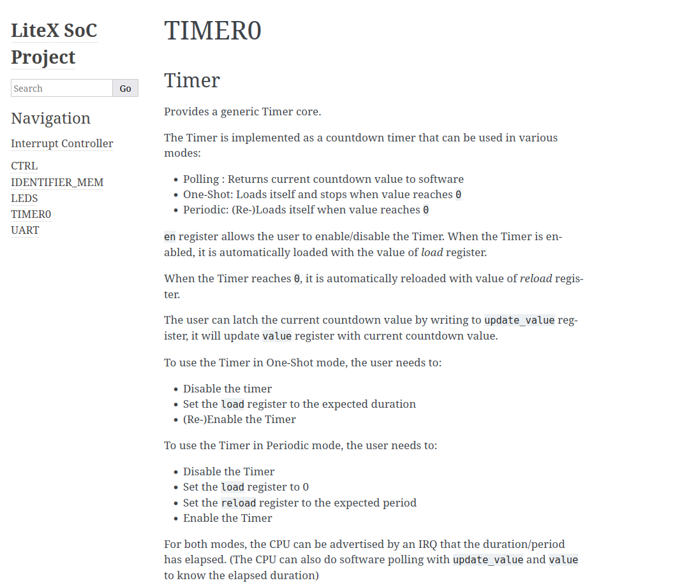

# Getting-Started-with-Colognechip-Eval-Board-and-LiteX
This Repository/Guide is supposed to be a resource, which covers using Litex with the Colognechip Eval Board, and start writing C/C++ Code for the SoC

It is a quick writedown and probably won't be the best writing style, though i still hope it helps people save some time getting it to work.

<b>This Guide is mainly aimed towards Linux users!</b>

# Getting started

## Required Hardware

- USB-UART Converter
- GateMate FPGA Evaluation Board
- USB Cable to connect to the USB-B-Mini Interface of the Evalboard

## Installation
This Guide assumes you have already installed the LiteX Framework and Boards aswell as the Gatemate Toolchain.  
https://github.com/enjoy-digital/litex (Litex Framework)  
https://github.com/litex-hub/litex-boards (Litex Boards)  
https://www.colognechip.com/docs/ug1002-toolchain-install-latest.pdf (Gatemate Toolchain)

There shouldnt be any big difficulties aslong as you follow the given Guides.

## Getting the SoC Running on the Board
Getting the SoC to running is as simple as just connecting to the prog connector via USB then:

Step 1: navigate to the litex-boards/targets directory  
Step 2: run ``./colognechip_gatemate_evb.py --build --flash``

After its done flashing the SoC will be running on the FPGA. Assuming you have installed everything correctly.

## Connecting to the Console of the SoC

In the litex-boards/platforms directory we can see a file named 
colognechip_gatemate_evb.py (This one is not identical to the one in the target subdirectory). Here we see all Pin definitions and assignments to the FPGA Pins, if you scroll down you will see this python function:

```python
def usb_pmod_io(pmod):
    return [
        # USB-UART PMOD: https://store.digilentinc.com/pmod-usbuart-usb-to-uart-interface/
        ("usb_uart", 0,
            Subsignal("tx", Pins(f"{pmod}:1")),
            Subsignal("rx", Pins(f"{pmod}:2")),
        ),
    ]
```

This defines the Pins which are going to be used for the UART Interface of the SoC (Basically the Console of the MCU).

Now if we go to the colognechip_gatemate_evb.py in the target subdirectory and scroll down a bit we see

```python
# USBUART PMOD as Serial-----------------------------------------
platform.add_extension(colognechip_gatemate_evb.usb_pmod_io("PMODB"))
kwargs["uart_name"] = "usb_uart"
```

Here we call the previous function to tell it which PMOD interface to use, luckily the PMODA and PMODB on the Evalboard are already defined.

<b>Putting it all together: </b>  We have a UART Console on PMODB Pins 1(tx) and 2(rx).  
<b>You will need a USB-UART Converter/PMOD connected accordingly to these Pins on the Evalboard</b>

Now to Connect to the Console execute ``litex_term {port}``
assuming your <b>{port}</b> is /dev/ttyUSB2, it will be ``litex_term /dev/ttyUSB2``. You will need to find out which device file is for your USB-UART Converter. 

in the Terminal, Restart/Reflash the FPGA and you should see a greeting messeage similar to

```
        __   _ __      _  __
       / /  (_) /____ | |/_/
      / /__/ / __/ -_)>  <
     /____/_/\__/\__/_/|_|
   Build your hardware, easily!

 (c) Copyright 2012-2024 Enjoy-Digital
 (c) Copyright 2007-2015 M-Labs

 BIOS built on Aug  7 2024 13:36:41
 BIOS CRC passed (ddfb819e)

 LiteX git sha1: f855417af

--=============== SoC ==================--
CPU:		VexRiscv @ 1MHz
BUS:		wishbone 32-bit @ 4GiB
CSR:		32-bit data
ROM:		128.0KiB
SRAM:		8.0KiB


--============== Boot ==================--
Booting from serial...
Press Q or ESC to abort boot completely.
sL5DdSMmkekro
Timeout
No boot medium found

--============= Console ================--

```

Congratulations, you have connected to the Console of ur SoC.
Here you can play around a bit if you feel like it, execute help and see the available options.

## Compiling your own Code for the Evalboard

Now it becomes interesting, the Key to Programming this whole thing nicely will be to have a Makefile that compiles the Programm for you.  

The C Code we will be working with is the following:

```C
#include <stdio.h>
#include <stdlib.h>
#include <string.h>

#include <irq.h>
#include <libbase/uart.h>
#include <libbase/console.h>
#include <generated/csr.h>

int main(void)
{
	uart_init();

	printf("Hello World!\n");

	return 0;
}

```

It Basically just prints Hello World and is finished then.

The Makefile, which i've stolen from the Demo Example (see: litex_bare_metal_demo), looks like the following for me:

```Make
# Both are just Example directories and should be replaced
# by the correct directories like talked about below
BUILD_DIR?=../build/colognechip_gatemate_evb
SOC_DIR=/home/{user}/Documents/litex/litex/soc/

include $(BUILD_DIR)/software/include/generated/variables.mak
include $(SOC_DIRECTORY)/software/common.mak

OBJECTS   = crt0.o main.o

all: demo.bin

%.bin: %.elf
	$(OBJCOPY) -O binary $< $@

	chmod -x $@

vpath %.a $(PACKAGES:%=../%)

demo.elf: $(OBJECTS)
	$(CC) $(LDFLAGS) -T linker.ld -N -o $@ \
		$(OBJECTS) \
		$(PACKAGES:%=-L$(BUILD_DIR)/software/%) \
		-Wl,--whole-archive \
		-Wl,--gc-sections \
		-Wl,-Map,$@.map \
		$(LIBS:lib%=-l%)

ifneq ($(OS),Windows_NT)
	chmod -x $@
endif

# pull in dependency info for *existing* .o files
-include $(OBJECTS:.o=.d)

VPATH = $(BIOS_DIRECTORY):$(BIOS_DIRECTORY)/cmds:$(CPU_DIRECTORY)


%.o: %.cpp
	$(compilexx)

%.o: %.c
	$(compile)

%.o: %.S
	$(assemble)

clean:
	$(RM) $(OBJECTS) demo.elf demo.bin .*~ *~

.PHONY: all clean
```

The only thing you have to replace should be the BUILD_DIR and the SOC_DIR.

The BUILD_DIR is the build directory, which was generated by our previous execution of ``./colognechip_gatemate_evb.py --build``.
You should find the build directory in the same directory, in which you have the python file. Which usually is the target directory of litex_boards.

The SOC_DIR is the one pointing toward the litex framework repositorys subdirectory called soc.

You might also wanna change the name of the result files.

## Uploading the Code to the Evalboard

After Compiling you will have a demo.bin, we wanna get this uploaded to the SoC of the Board

Now theres a few Issues im still having with uploading the Code, I will first show the way that works for me, and a way that is easier and might work for you.

### Method 1: 

Running ``./colognechip_gatemate_evb.py --build --integrated-rom-init=demo.bin --load``
will load the Binary onto the SoC's ROM

This Method works great but its big downside is that you have to recompile the Gateware every single time and it does take close to a minute for me.

It can also be integrated into your Makefile by adding the targets

```
load:  
	make all
	./colognechip_gatemate_evb.py --build --integrated-rom-init=demo.bin --load

flash:  
    make all
	./colognechip_gatemate_evb.py --build --integrated-rom-init=demo.bin --flash
```

### Method 2:

Running ``litex_term /dev/ttyUSB2 --kernel=demo.bin``
should upload the Code onto the SoC at Runtime, meaning no need for a big recompile. Now this Method sadly didnt work for me, cause i always got a CRC Error, which might be a faulty USB-UART Converter but i can't know for sure right now. I hope it works for you.

## Finding the Registers and Documentation of the Peripherals

To do this, you can just run ``./colognechip_gatemate_evb.py --build --doc`` which creates a doc directory in the build directory of the board. Navigate to build->html and you will see all HTML Files, which Document the Onchip Peripherals 

Example for the timer0.html


Now you can treat it like the usual Embedded MCU

## Further Resources

If you wanna add your own Peripherals or Expand them, theres 2 Tutorials covering this so i recommend checking them out, i've also used these as help for creating this tutorial.

https://justanotherelectronicsblog.com/?p=1263  
https://www.controlpaths.com/2022/01/17/building-soc-litex/